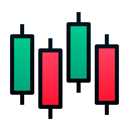
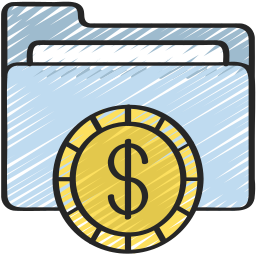

<a href="https://link_to_final_report">
<p align="center">


</p></a>
<p align="center">
  <strong>Automating Portfolio Allocation with Reinforcement Learning</strong>
</p>

# AssetAllocator

## Installation

```
pip install AssetAllocator
```

## Usage


### Available Models and their keys
| Model Name              |      Key          |
| :-------------------- | :-----------------------: |
| [Normalized Advantage Function](https://arxiv.org/abs/1906.04594)     |      NAF           |
| [REINFORCE](https://proceedings.neurips.cc/paper/1999/file/464d828b85b0bed98e80ade0a5c43b0f-Paper.pdf)  |     REINFORCE     |
| [Deep Deterministic Policy Gradient](https://arxiv.org/abs/1509.02971)      |  DDPG     |
| [Twin Delayed Deep Deterministic Policy Gradient](https://arxiv.org/abs/1802.09477)    |   TD3        |
| [Advantage Actor Critic](https://arxiv.org/abs/1802.09477)        |   A2C        |
| [Soft Actor Critic](https://arxiv.org/abs/1802.09477)      |   SAC        |
| [Trust Region Policy Optimization](https://arxiv.org/abs/1502.05477)        |   TRPO           |
| [Proximal Policy Optimization](https://arxiv.org/abs/1707.06347)        | PPO     |


### Running Experiments
```
import torch
from AssetAllocator.experiment import Experiment

device = 'cuda' if torch.cuda.is_available() else 'cpu'

trainer_kw = {'print_every': 1, 'test_runs': 1}
model_kw = {'device': device}

exp = Experiment(trainer_kwargs=trainer_kw, model_kwargs=model_kw)
exp.run('SAC')
```

```
exp = Experiment(trainer_kwargs=trainer_kw, model_kwargs=model_kw, timesteps=[1_000_000])
exp.run('SAC')
```

### Hyperparameter Tuning
The Experiment class has support for overriding agent, trainer, and environment parameters. Check the [docs](https://eloyjaws.github.io/AssetAllocator/) for more details about the [agent](https://eloyjaws.github.io/AssetAllocator/algorithms/index.html), [trainer](https://eloyjaws.github.io/AssetAllocator/trainer.html), and [environment](https://eloyjaws.github.io/AssetAllocator/environments/PortfolioGym.html) and pass in the appropriate dictionaries to the Experiment class. An example can be seen below

```
trainer_kw = {
    'experiment_name': 'time_to_get_rich', 
    'print_every': 100, 
    'test_runs': 10, 
    'add_softmax'=True, 
    'start_date'='2009-01-01', 
    'end_date'='2022-01-01', 
    'seed'=667, 
    'test_length'=550,
    'test_runs'=1
    }

model_kw = {
    'device': device,
    'hidden_dim'=256, 
    'gamma'=0.9,
    }

exp = Experiment(trainer_kwargs=trainer_kw, model_kwargs=model_kw)
exp.run('A2C')
```

### More Examples
We have provided several example notebooks to help you [get started]()

## Dependencies
- gym
- torchvision
- scipy
- torch
- yfinance
- stable_baselines3
- numpy
- tqdm
- pandas
- matplotlib

## Contributions
AssetAllocator is open to contributions

## Attribution
Logos [1](https://www.flaticon.com/premium-icon/candlestick_2207346), [2](https://www.flaticon.com/premium-icon/portfolio_3345142) obtained from [flaticon](https://www.flaticon.com)
